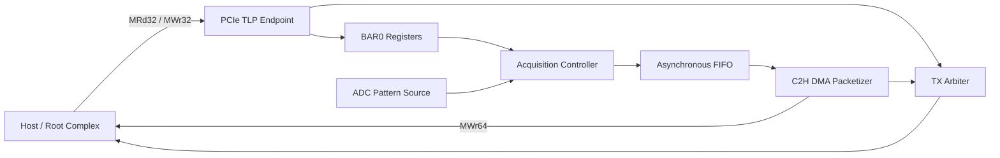

# PCIe FPGA Data Acquisition Engine

[](https://github.com/wdcyl/PCIE/actions/workflows/ci.yml)

面向 FPGA 开发学习与工程展示的 PCIe 高速数据采集内核。项目从事务层出发，实现 BAR0 控制、MRd/MWr/CplD、双时钟采集、异步 FIFO、C2H DMA TLP、事件中断和端到端自检。

## 主要功能

- 256-bit 单拍 TLP 内部接口，支持 `valid/ready` 背压。
- BAR0 单 DW `MRd32`、`MWr32`，读请求返回 `CplD`。
- Completion 正确返回 Requester ID、Tag、Byte Count、Lower Address和Completer ID。
- 未映射或不支持的 Memory Read 返回 `UR Cpl`；非法 `MWr32/MWr64` 只计错、不返回 Completion。
- 16-bit ADC数据源：Ramp、PRBS16、常量、三角波。
- Toggle CDC命令跨时钟域与Gray计数器状态回传。
- 参数化 Gray Pointer 异步 FIFO。
- C2H DMA：生成 `MWr64`，每包最多8个16-bit样本。
- 自动处理尾部奇数样本Byte Enable和4 KiB边界拆包。
- Completion/DMA发送仲裁、粘滞中断、W1C中断清除。
- 自动回归覆盖随机背压、数据一致性、非法访问、边界拆包、溢出和恢复。

## 系统结构



工程内部使用规范化的 TLP 格式。连接实际器件时，在顶层前增加厂商 PCIe Hard IP适配层，将 Xilinx/Intel接口转换为该内部格式。详细边界和两种上板方案见 [设计说明](docs/DESIGN.md)。

## 快速运行

依赖：

- Python 3
- Icarus Verilog 11或更新版本

运行：

```bash
python scripts/run_sim.py
```

成功时输出：

```text
=== Regression summary ===
checks=23 errors=0 cpl=6 dma_packets=15 dma_bytes=226
ALL TESTS PASSED
```

波形生成在 `build/pcie_acq.vcd`。

## 目录

```text
PCIE/
├── rtl/
│   ├── pcie_tlp_endpoint.sv    # BAR请求解析及Completion生成
│   ├── bar_registers.sv        # BAR0控制与状态寄存器
│   ├── adc_pattern_source.sv   # 可综合ADC替代数据源
│   ├── acquisition_controller.sv
│   ├── async_fifo.sv           # Gray指针双时钟FIFO
│   ├── c2h_dma_engine.sv       # MWr64 C2H DMA打包
│   ├── tlp_tx_arbiter.sv       # Completion/DMA发送仲裁
│   └── pcie_acq_top.sv         # 顶层集成
├── sim/
│   └── tb_pcie_acq.sv          # Root Complex与Host Memory行为模型
├── scripts/
│   └── run_sim.py
├── docs/
│   ├── DESIGN.md
│   ├── REGISTER_MAP.md
│   └── VERIFICATION.md
└── .github/workflows/ci.yml
```

## 当前工程边界

本仓库实现 PCIe事务层学习内核与采集数据通路，不包含特定板卡的GT收发器、LTSSM、Data Link Layer或加密厂商Hard IP网表。当前限制：

- BAR只支持单DW MRd32/MWr32。
- DMA只实现C2H Posted MWr64，不包含H2C、描述符环和多队列。
- 内部TLP一次完整放入256-bit单拍，Payload最大4DW。
- 板级时钟、引脚约束和Hard IP Wrapper需在选定FPGA/开发板后补充。

这些边界均在文档中显式说明，便于后续继续扩展，而不会把厂商PHY能力误写成自研RTL能力。

## 文档

- [详细设计与IP说明](docs/DESIGN.md)
- [BAR0寄存器表](docs/REGISTER_MAP.md)
- [验证方案与测试结果](docs/VERIFICATION.md)

## License

MIT
